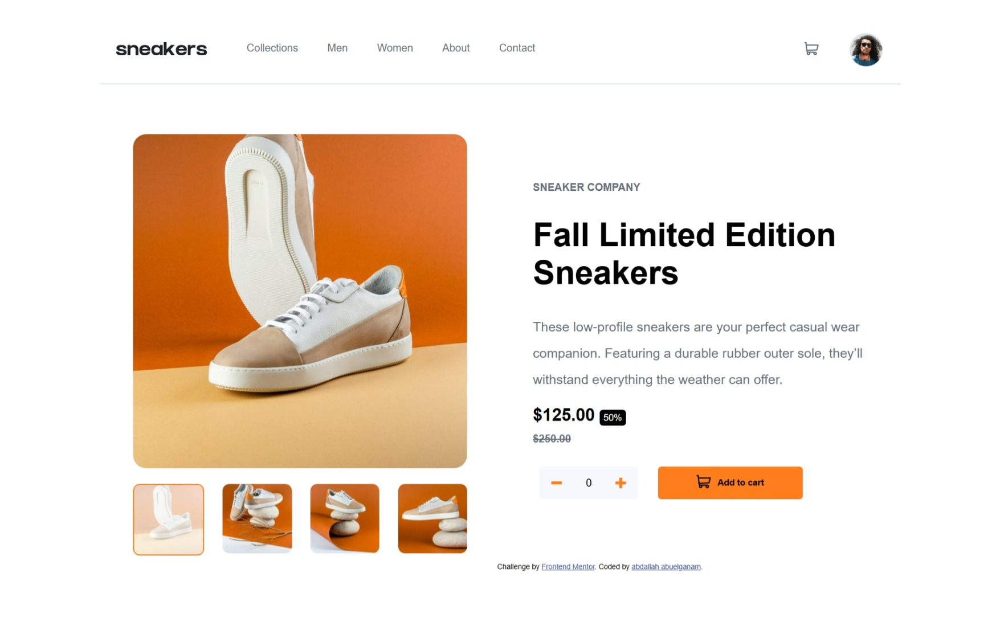
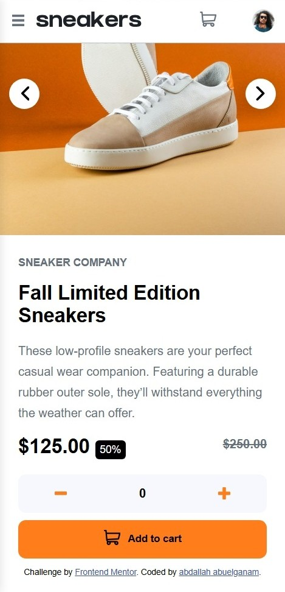

# Frontend Mentor - E-commerce product page solution

This is a solution to the [E-commerce product page challenge on Frontend Mentor](https://www.frontendmentor.io/challenges/ecommerce-product-page-UPsZ9MJp6). Frontend Mentor challenges help you improve your coding skills by building realistic projects.

## Table of contents
- [Overview](#overview)
- [The challenge](#the-challenge)
- [Screenshot](#screenshot)
- [Links](#links)
- [My process](#my-process)
- [Built with](#built-with)
- [What I learned](#what-i-learned)
- [Continued development](#continued-development)
- [Author](#author)

## Overview

### The challenge

Users should be able to:
- View the optimal layout for the site depending on their device's screen size
- See hover states for all interactive elements on the page
- Open a lightbox gallery by clicking on the large product image
- Switch the large product image by clicking on the small thumbnail images
- Add items to the cart
- View the cart and remove items from it

### Screenshot

## Links
- Solution URL: [Add solution URL here](https://your-solution-url.com)
- Live Site URL: [Add live site URL here](https://your-live-site-url.com)

## My process

- Started with semantic HTML structure (see `index.html`)
- Styled the layout using CSS (see `CSS/style.css`)
- Added responsive design for mobile devices (see `CSS/mobile.css`)
- Implemented JavaScript functionality for the lightbox, cart, and image gallery (see `JS/node.js`)

## Built with
- Semantic HTML5 markup
- CSS custom properties
- Flexbox
- CSS Grid
- Mobile-first workflow
- JavaScript (vanilla)

## What I learned

- How to create a responsive image gallery with thumbnails
- How to implement a lightbox feature using JavaScript
- How to manage cart functionality dynamically

## Continued development

- Further practice with advanced JavaScript features
- Explore more efficient ways to handle state management in vanilla JavaScript

## Author

- Name: Abdallah AbuElganam
- Frontend Mentor: [@AbdallahAbuelganam](www.frontendmentor.io/profile/AbdallahAbuelganam)
- Instagram: [@abdallah_abuelghanam](www.instagram.com)
